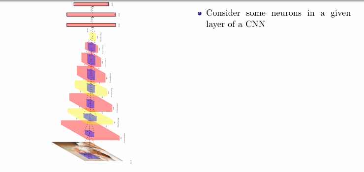
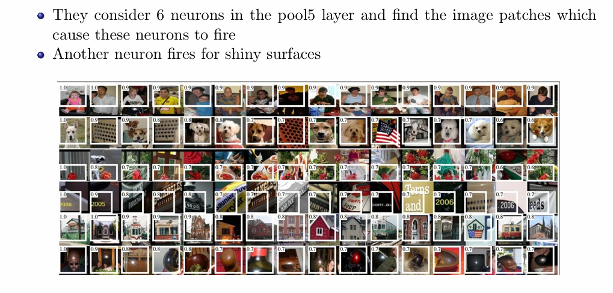
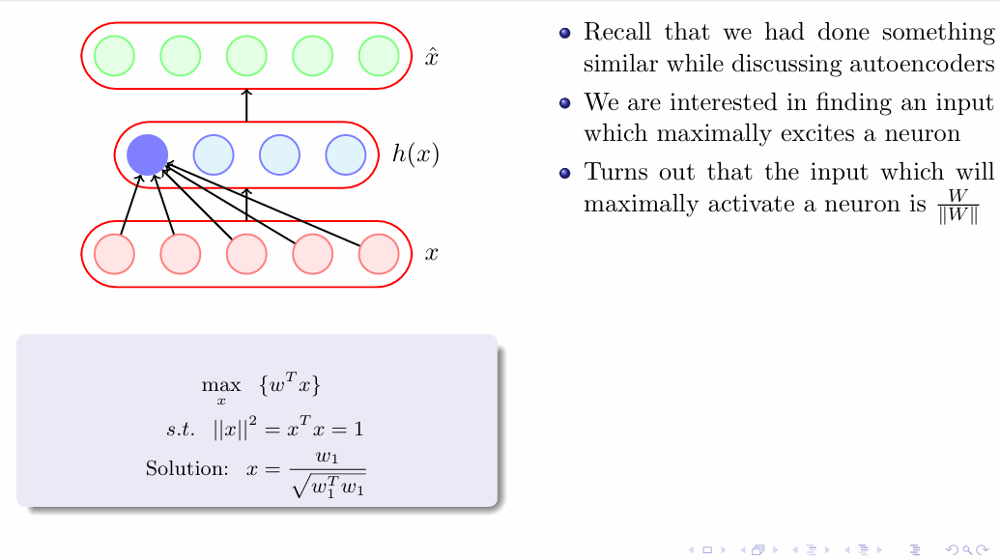
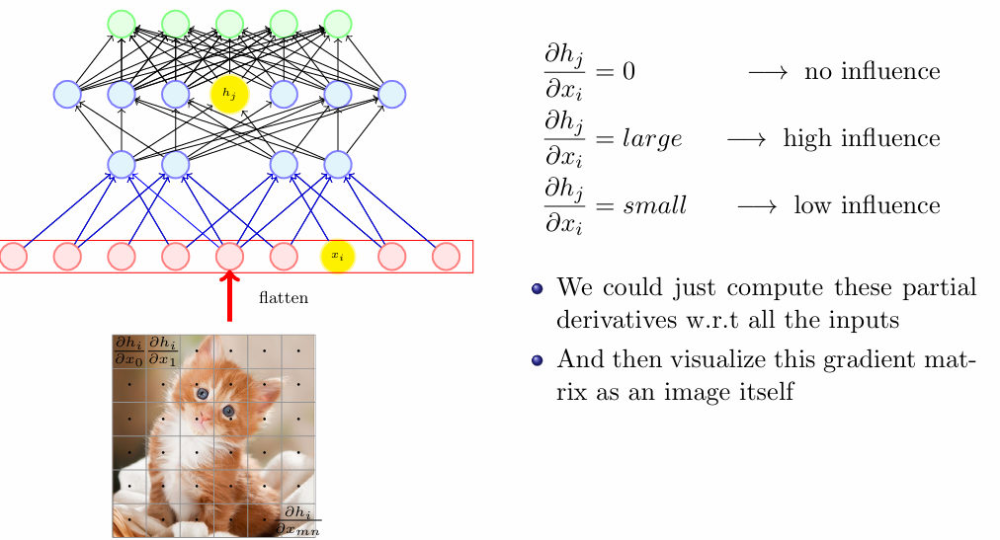
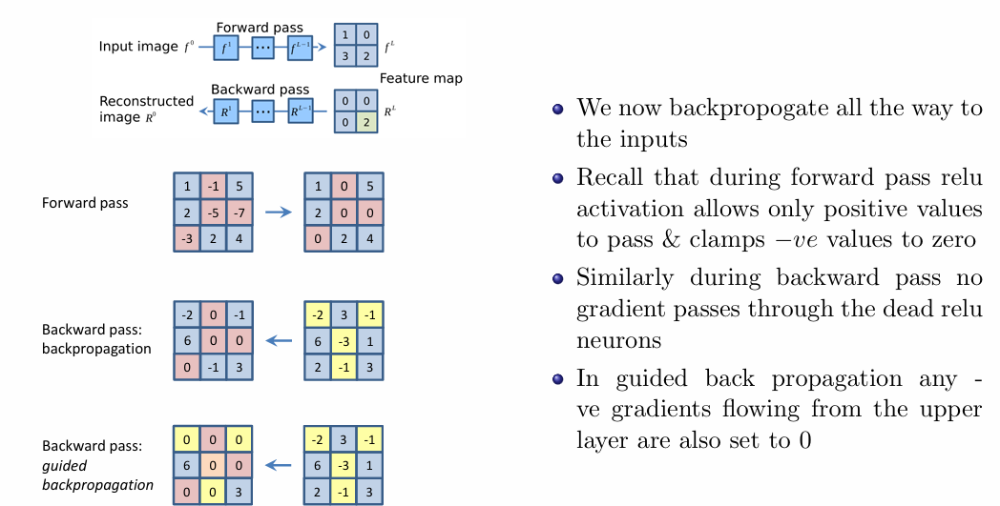
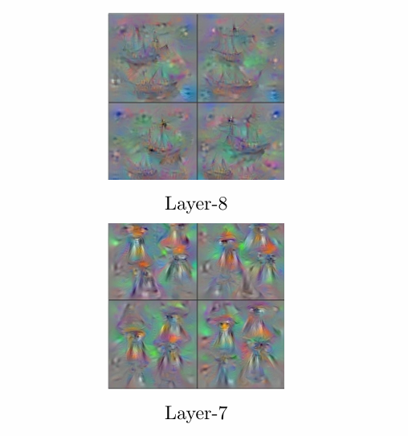
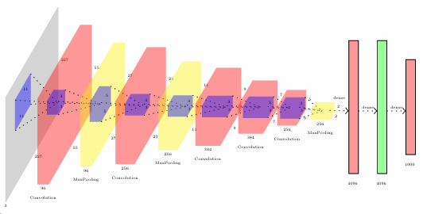
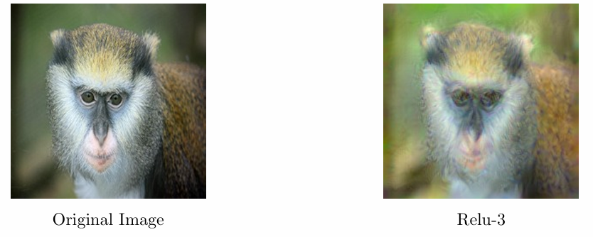
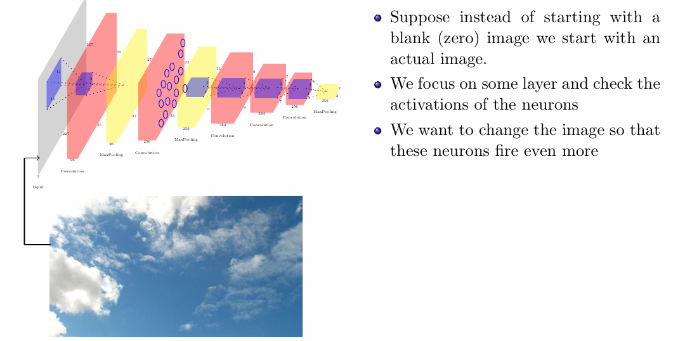
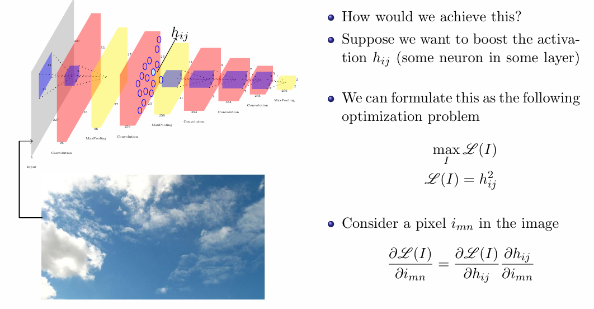

1. **Objective**: Track the position of an airplane using a laser sensor at discrete time intervals.

  
1. **Challenge**: The sensor data is noisy, which can distort the measurements.

2. **Solution**: Use a weighted average of several measurements to obtain a smoother (less noisy) estimate of the airplane's position.

3. **Weighted Averaging**:
   - More recent measurements are considered more relevant.
   - Hence, a weighted average is applied, where recent measurements have higher weights.

4. **Convolution Equation**:
   - 
   - $s_t = \sum_{a=0}^{\infty} x_{t-a} \cdot w_{-a} = (x * w)_t$
   - This equation describes the convolution operation, where:
     - $s_t$: Output signal at time step $t$.
     - $x_{t-a}$: Input signal (measurement) at time step $t-a$.
     - $w_{-a}$: Weight (or filter) applied to the input signal.
     - $\sum_{a=0}^{\infty}$: Summation over all past time steps $a$, from $0$ to $\infty$.

5. **Result**:
   - The convolution operation $s_t$ yields a smoother output signal, reducing the noise in the measurements by averaging them with a weight that prioritizes recent data.

6. **Definition**:
   - The convolution operation for the output signal $s_t$ at time step $t = 6$ is computed as:
    $$
     s_6 = x_6 w_0 + x_5 w_{-1} + x_4 w_{-2} + x_3 w_{-3} + x_2 w_{-4} + x_1 w_{-5} + x_0 w_{-6}
    $$
   - This summation occurs over a **finite window** of recent inputs, limiting the computation to the most recent few values.

7. **Filter (Weight Array)**:
   - The filter (weight array $w$) defines the importance of each input value within the window.
   - Example filter values:
     $$
     w = [0.01, 0.01, 0.02, 0.02, 0.04, 0.4, 0.5]
     $$
   - Here, more recent measurements (weights closer to $w_0$) are given higher values, making them more influential.

8. **Input Signal (x)**:
   - The input signal values over time are given as:
     $$
     x = [1.00, 1.10, 1.20, 1.40, 1.70, 1.80, 1.90, 2.10, 2.20, 2.40, 2.50, 2.70]
     $$

9.  **Output Signal Calculation (s)**:
   - The output signal values $s$ are calculated by applying the filter to each window of inputs.
   - Example output values:
     $$
     s = [0.00, 1.80, 1.96, 2.11, 2.16, 2.28, 2.42]
     $$

10. **Sliding Window Approach**:
   - The filter slides over the input, computing each $s_t$ by applying weights to the current window of input values centered around $x_t$.
   - This approach helps produce a smoother output signal by reducing noise and emphasizing recent measurements.

11. **Extending to 2D**:
   - Yes, convolution can be applied to **2D inputs** as well, where the filter moves over a 2D grid (e.g., image) rather than a 1D sequence).

---

### 1. **Concept of 2D Convolution**:
   - In a **2D convolution**, a small matrix called a *kernel* or *filter* slides over a 2D input (such as an image) to produce an output called a **feature map**.
   - Each time the kernel slides to a new position, it computes a weighted sum of the input values, where the weights are defined by the kernel values.

### 2. **Examples of Common Kernels**:

   - **Blurring Kernel**:
     $$
     \text{Kernel} = \begin{bmatrix} 1 & 1 & 1 \\ 1 & 1 & 1 \\ 1 & 1 & 1 \end{bmatrix}
     $$
     Applying this kernel averages neighboring pixel values, creating a blurred effect.

   - **Sharpening Kernel**:
     $$
     \text{Kernel} = \begin{bmatrix} 0 & -1 & 0 \\ -1 & 5 & -1 \\ 0 & -1 & 0 \end{bmatrix}
     $$
     This kernel enhances edges and details, making the image appear sharper.

   - **Edge Detection Kernel**:
     $$
     \text{Kernel} = \begin{bmatrix} 1 & 1 & 1 \\ 1 & -8 & 1 \\ 1 & 1 & 1 \end{bmatrix}
     $$
     This kernel highlights the edges by emphasizing regions with high contrast.

### 3. **Sliding the Kernel**:
   - The kernel slides over the image, computing one output value per position by performing a weighted sum of pixel values within the kernel’s window.
   - The output at each position forms a single element in the resulting feature map.

### 4. **Output - Feature Map**:
   - Each kernel application produces a **feature map**, representing one type of transformation (e.g., blurring, sharpening, or edge detection).
   - **Multiple filters** can be applied to the same image to generate multiple feature maps, each highlighting different image characteristics.

### 5. **Extending to Higher Dimensions**:
   - In the **1D case**, a 1D filter slides over a 1D input (e.g., a time-series data).
   - In the **2D case**, a 2D filter slides over a 2D input (e.g., an image).
   - **3D Convolution**: This would involve a 3D filter applied to a 3D input (e.g., volumetric data, video frames over time).

To understand the relationship between input size, output size, and filter size in a convolutional layer, we can define some key quantities and derive the output dimensions based on these. Here’s the breakdown in points and notation:

### Key Quantities
1. **Input Dimensions**:
   - Width of input: $W_1$
   - Height of input: $H_1$
   - Depth of input: $D_1$

2. **Filter Characteristics**:
   - Number of filters: $K$
   - Spatial extent of each filter (filter size): $F$
   - Depth of each filter: same as depth of input, $D_1$

3. **Stride**:
   - Stride: $S$ (This is the step size at which the filter moves over the input.)

4. **Output Dimensions**:
   - Width of output: $W_2$
   - Height of output: $H_2$
   - Depth of output: $D_2 = K$ (since each filter produces one channel in the output)

### Calculating the Output Dimensions

To compute the dimensions $W_2$ and $H_2$ of the output, use the following formulas:

$$
W_2 = \frac{W_1 - F}{S} + 1
$$
$$
H_2 = \frac{H_1 - F}{S} + 1
$$

### Important Observations

- **Boundary Condition**: The filter cannot be placed at the edges or corners of the input if it would cross the input boundaries. This limits the area over which the filter can be applied, leading to a smaller output dimension than the input.
- **Impact of Filter Size**: As the filter size $F$ increases, the output dimensions $W_2$ and $H_2$ decrease because more of the input area is excluded at the boundaries. For example, using a $5 \times 5$ filter would yield a smaller output than using a $3 \times 3$ filter for the same input.

### Summary

In summary, the output dimensions $W_2$, $H_2$, and $D_2$ depend on:
- **Input dimensions** $W_1$, $H_1$, and $D_1$
- **Filter size** $F$
- **Stride** $S$
- **Number of filters** $K$

A **filter** (also known as a **kernel** or **convolutional kernel**) in the context of convolutional neural networks (CNNs) is a small matrix of values used to detect patterns, features, or regions of interest in the input data, such as images. The filter "slides" over the input, performing an element-wise multiplication between the values in the filter and a portion of the input, producing a single output value. This operation is repeated across the entire input to generate a transformed output, called the **feature map**.

### Key Characteristics of Filters

1. **Size**:
   - Filters have a specified **height** and **width**, often represented as $F \times F$, where $F$ is the spatial extent of the filter.
   - Common filter sizes are $3 \times 3$, $5 \times 5$, or $7 \times 7$.
   - The **depth** of a filter matches the depth of the input it is applied to. For example, if an image has three color channels (RGB), each filter would also have a depth of 3.

2. **Weights in a Filter**:
   - Each position in the filter has a **weight**, which is a learned value that adapts during the training process to detect specific patterns.
   - These weights are applied to regions of the input, and their learned values help the filter to recognize features like edges, textures, or complex patterns.

3. **Number of Filters**:
   - A layer in a CNN typically uses multiple filters to capture various features of the input.
   - For example, one filter might detect vertical edges, another might detect horizontal edges, and others might capture texture patterns or other features.

4. **Stride**:
   - The **stride** determines how much the filter moves each time it slides across the input. A stride of 1 means the filter moves one pixel at a time, while a stride of 2 means it moves two pixels at a time.
   - The stride affects the output dimensions: a larger stride results in a smaller output size.

### Example of a Filter in Action

Consider a **3x3 filter** sliding over a **5x5 grayscale image**:

- **Filter**:
  $$
  \begin{bmatrix}
  -1 & 0 & 1 \\
  -1 & 0 & 1 \\
  -1 & 0 & 1 \\
  \end{bmatrix}
  $$
  This filter is designed to detect **vertical edges**.

- **Image (5x5)**:
  $$
  \begin{bmatrix}
  0 & 0 & 0 & 0 & 0 \\
  0 & 255 & 255 & 255 & 0 \\
  0 & 255 & 255 & 255 & 0 \\
  0 & 255 & 255 & 255 & 0 \\
  0 & 0 & 0 & 0 & 0 \\
  \end{bmatrix}
  $$

When the filter is applied to the image, it performs element-wise multiplication and sums the results for each position. For example:

1. The filter starts at the top-left corner of the image, aligning with the first $3 \times 3$ section.
2. The filter slides over one pixel to the right, computes a new weighted sum, and repeats this process across the image.

### Summary

- A **filter** is a small matrix used in CNNs to extract patterns or features from an input.
- Filters vary in size, depth, and weight values, and are optimized during training to detect specific features.
- Applying filters across an input results in a **feature map**, which represents the transformed output and highlights the detected features.

### General Formula for Output Dimensions

Given:
- **Input Width ($W_1$)** and **Input Height ($H_1$)**
- **Filter Size** (or **Spatial Extent, $F$**): For a square filter, $F \times F$
- **Stride $S$**: The number of pixels the filter moves at each step (typically 1)
- **Padding $P$**: Zero-padding applied to input borders, often to preserve output size

The formulas for output width ($W_2$) and height ($H_2$) without considering padding are as follows:

$$
W_2 = \frac{W_1 - F}{S} + 1
$$
$$
H_2 = \frac{H_1 - F}{S} + 1
$$

### Boundary Constraints and Smaller Outputs

If padding is **not** applied, the filter cannot process the edge pixels fully, as it would go beyond the input's boundaries. This results in reduced output dimensions relative to the input.

#### Example: 5x5 Kernel on Smaller Outputs

Consider an input with:
- Input Width ($W_1$) = 10
- Input Height ($H_1$) = 10

Using a $5 \times 5$ kernel (with no padding and a stride of 1):

$$
W_2 = H_2 = \frac{10 - 5}{1} + 1 = 6
$$

Thus, the output dimensions are $6 \times 6$, which is smaller than the input dimensions. 

### Impact of Filter Size

This reduction in size becomes more pronounced as the filter size increases relative to the input dimensions. With larger filters, fewer pixels remain for the filter to slide across, leading to even smaller output dimensions.

To maintain the same output size as the input, we can use **padding**, which involves adding a certain number of extra rows and columns (filled with zeros) around the input matrix. This allows the filter to be applied even at the borders without reducing the output dimensions.

### Padding Explained
Padding fills the border of the input matrix with zeros, enabling the kernel to slide across the entire input, including the corners. This way, the output has the same width and height as the original input.

#### Example of Padding with $ P = 1 $
If we use a $3 \times 3$ filter with padding $ P = 1 $:
- We add one row of zeros at the top and bottom and one column of zeros on the left and right.
- This effectively increases the input dimensions by 2 (one zero-padding on each side).

### Formula for Output Dimensions with Padding
The formulas for output width ($W_2$) and height ($H_2$) when padding is applied become:

$$
W_2 = \frac{W_1 - F + 2P}{S} + 1
$$
$$
H_2 = \frac{H_1 - F + 2P}{S} + 1
$$

### Example
For an input size of $W_1 = 5$ and $H_1 = 5$, with a filter size $F = 3$, padding $P = 1$, and stride $S = 1$:

$$
W_2 = \frac{5 - 3 + 2 \times 1}{1} + 1 = 5
$$
$$
H_2 = \frac{5 - 3 + 2 \times 1}{1} + 1 = 5
$$

Thus, the output dimensions remain $5 \times 5$, the same as the input dimensions. 

By adjusting $P$, we can control the output size relative to the input size, often preserving it or customizing it as needed for specific applications.

The **stride $S$** defines the step size at which the filter moves across the input. A larger stride results in the filter “jumping” over pixels, effectively reducing the size of the output. 

### Understanding Stride with an Example
- With a stride $S = 1$, the filter slides over each adjacent pixel, providing maximum overlap.
- With a stride $S = 2$, the filter skips every second pixel, resulting in fewer positions for the filter to be applied and, thus, a smaller output size.

### Updated Formula with Stride
Taking stride into account, the formula for the output dimensions $W_2$ and $H_2$ becomes:

$$
W_2 = \frac{W_1 - F + 2P}{S} + 1
$$
$$
H_2 = \frac{H_1 - F + 2P}{S} + 1
$$

### Example
For an input with:
- Width $W_1 = 7$, Height $H_1 = 7$
- Filter size $F = 3$
- Padding $P = 1$
- Stride $S = 2$

The output dimensions would be:

$$
W_2 = \frac{7 - 3 + 2 \times 1}{2} + 1 = 4
$$
$$
H_2 = \frac{7 - 3 + 2 \times 1}{2} + 1 = 4
$$

So, the output would be $4 \times 4$, showing that increasing the stride reduces the output size. This is commonly used to downsample data within convolutional networks.
 
---

In convolutional layers, the **depth of the output** ($D_2$) is determined by the number of filters applied. Here’s a step-by-step breakdown:

### 1. Depth of Output ($D_2$)
   - Each filter produces a single 2D output, known as a feature map.
   - By applying $K$ filters, we get $K$ 2D feature maps.
   - Therefore, the depth $D_2$ of the output is simply $K$, i.e., $D_2 = K$.

   We can view the final output as a **volume of dimensions $K \times W_2 \times H_2$**.

### 2. Final Formula for Output Dimensions
   Including width, height, and depth, the formulas are as follows:

   - Width:  
     $$ 
     W_2 = \frac{W_1 - F + 2P}{S} + 1 
     $$

   - Height:  
     $$ 
     H_2 = \frac{H_1 - F + 2P}{S} + 1 
     $$

   - Depth:  
     $$ 
     D_2 = K 
     $$

### Example Calculation
Given:
   - Input width $W_1 = 32$, height $H_1 = 32$, and depth $D_1 = 1$
   - Filter size $F = 5$
   - Number of filters $K = 6$
   - Stride $S = 1$
   - Padding $P = 0$

   Calculating output dimensions:

   $$
   W_2 = \frac{32 - 5 + 2 \times 0}{1} + 1 = 28
   $$
   $$
   H_2 = \frac{32 - 5 + 2 \times 0}{1} + 1 = 28
   $$
   $$
   D_2 = K = 6
   $$

The output dimensions are $6 \times 28 \times 28$, showing a volume with height and width reduced by the kernel size and depth determined by the number of filters.

In **Convolutional Neural Networks (CNNs)**, the convolution operation is a foundational building block. CNNs are particularly effective in image classification tasks, and here’s how convolution fits into the architecture of a neural network:

### Key Concepts and Connection to Neural Networks
- **Convolution Operation**: CNNs apply convolutional filters (kernels) over an input image to detect various features like edges, textures, and patterns. 
- **Learnable Filters**: Unlike traditional edge detectors or handcrafted filters, CNNs learn these filters automatically during training. This means they can identify the most relevant features for a given task, such as recognizing different objects in an image.
- **Multiple Layers of Filters**: CNNs typically use multiple layers, each containing many filters that learn progressively complex features:
  - **Lower layers** detect simple features, such as edges or textures.
  - **Higher layers** combine these features to recognize more complex shapes or entire objects.
  
### Training Filters with Backpropagation
- **Learning Filters**: During training, CNNs treat filters as learnable parameters, similar to the weights in a fully connected neural network.
- **Backpropagation**: Using backpropagation, CNNs adjust filter values along with classifier weights to minimize classification error, leading to an optimal set of learned filters for the task.

### Final Perspective
This structure allows CNNs to automatically and efficiently learn feature representations directly from the data. By stacking layers of learned filters, CNNs become highly effective at complex tasks like image classification, making them central to many vision-based AI systems.

### Differences between the CNN and Feed forward neural network

